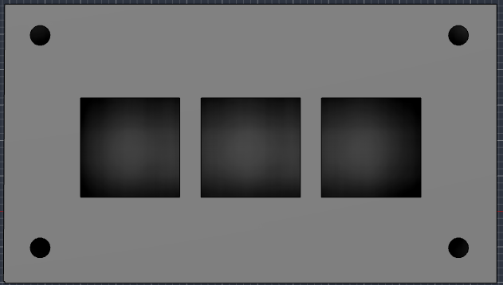
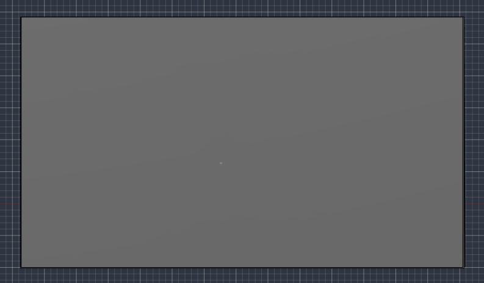

## Overview

## Schematic

## PCB

# stardance-macropad

## Photos

## Bill of Materials

| Part | Qty | Notes |
|------|-----|-------|
| Seeed XIAO ESP32C3 | 1 | Microcontroller |
| Mechanical switches | 3 | |
| Keycaps | 3 | |
| Diodes (if used) | 3 | |
| Custom PCB | 1 | Ordered via JLCPCB |
| Case (3D printed) | 1 | |
| M3 screws | 4 | Check your CAD for the real count |
